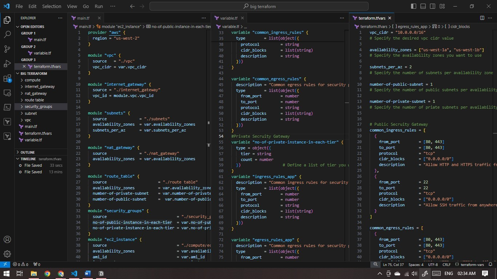

# Infrastructure as Code with Terraform

This repository contains the Terraform configuration files for provisioning infrastructure on AWS.

## Overview

The infrastructure is provisioned using Terraform modules to create a Virtual Private Cloud (VPC), subnets, internet gateway, NAT gateway, route tables, security groups, and EC2 instances.



## Usage

1. Clone the repository:

   ```bash
   git clone https://github.com/yourusername/your-terraform-project.git
   ```

2. Navigate to the project directory:

   ```bash
   cd your-terraform-project
   ```

3. Set up your Terraform environment by initializing the modules:

   ```bash
   terraform init
   ```

4. Review the `terraform.tfvars` file and update the variables as needed to match your requirements.

5. Preview the changes Terraform will make:

   ```bash
   terraform plan
   ```

6. Apply the changes to create the infrastructure:

   ```bash
   terraform apply
   ```

7. When finished, you can destroy the infrastructure:

   ```bash
   terraform destroy
   ```

## Modules

### VPC

The VPC module creates a Virtual Private Cloud with the specified CIDR block.

### Internet Gateway

The Internet Gateway module attaches an internet gateway to the VPC to enable internet access for resources within the VPC.

### Subnets

The Subnets module creates public and private subnets across multiple availability zones.

### NAT Gateway

The NAT Gateway module provisions NAT gateways in each public subnet to enable private instances to access the internet.

### Route Table

The Route Table module configures route tables for the subnets, including routes to the internet gateway and NAT gateway.

### Security Groups

The Security Groups module defines security group rules for controlling inbound and outbound traffic to EC2 instances.

### EC2 Instance

The EC2 Instance module provisions EC2 instances in the specified subnets with the specified configurations.

## Variables

- `vpc_cidr`: The CIDR block for the VPC.
- `availability_zones`: A list of availability zones.
- `subnets_per_az`: The number of subnets to create per availability zone.
- `number-of-public-subnet`: The number of public subnets per availability zone.
- `number-of-private-subnet`: The number of private subnets per availability zone.
- `no-of-public-instance-in-each-tier`: The number of instances in each tier for the public subnet.
- `no-of-private-instance-in-each-tier`: The number of instances in each tier for the private subnet.
- `ami_id`: The ID of the Amazon Machine Image (AMI) for the EC2 instances.
- `instance_type`: The type of EC2 instances to launch.

## Contributors

- [Deepak TM](https://github.com/tallbrat)

---

Feel free to customize it further to match your specific project structure and requirements.
